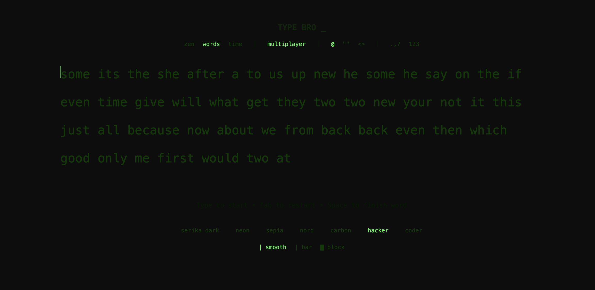

# TYPE BRO _
Inspired by [Monkeytype](https://monkeytype.com)

Live at [type-bro-six.vercel.app](https://type-bro-six.vercel.app/)

  
   
  

A high-performance, minimalist, and aesthetic typing application built with React and Vite.

## Comprehensive Features

### 1. WebRTC Serverless Multiplayer
Type Bro supports real-time peer-to-peer racing without a centralized database. 
- **The Matchmaking Lobby**: A host can create a private room and generate a direct 4-digit code. Guests can enter this code to securely connect their client directly to the host's client.
- **Synchronized Rulesets**: When the host initiates the test, the exact Word Seed, Target Time Limit, and active Text Options (Quotes, Code, Punctuation) are sent across the connection to ensure absolute symmetry.
- **Ghost Caret Tracking**: Your opponent's exact progress is transmitted every 100 milliseconds via WebRTC data channels, rendering as a translucent 'Ghost Caret' gliding across your screen alongside their live WPM metric.

### 2. Deep Metrics and Keyboard Heatmap Analytics
- **Industry-Standard Computing**: WPM is strictly calculated as `(Correct Characters / 5) / Time`, normalizing output speeds across dense literature quoting and sparse coding syntax. 
- **Smoothed SVG Graphing**: Upon test completion, users receive a Catmull-Rom smoothed data visualization mapping both their WPM and Raw Keystrokes second-by-second.
- **The QWERTY Heatmap**: The engine tracks the failure rate of every individual character pressed. The final results screen generates a physical, color-coded map of your keyboard, highlighting the keys you struggled with the most to focus your training.

### 3. Dynamic Text Modes and Modifiers
Type Bro allows extreme flexibility in simulating real-world scenarios:
- **Standard Words (`@`)**: A randomized sequence selected from a pool of 100 high-frequency English vocabulary words.
- **Literature Quotes (`""`)**: Type out renowned sentences and lengthy dialog taken directly from famous books and movies.
- **JavaScript Code (`<>`)**: Practice programming speed by typing raw syntax, reserved keywords, and camelCase functions.
- **Punctuation (`.,?`)**: Dynamically inject commas, periods, and question marks into the text feed randomly.
- **Numbers (`123`)**: Layer digits seamlessly into the text sequence.

### 4. Advanced Time Clocks and Limits
- **Words Mode**: A fixed-length sprint where the test naturally concludes after the 50th word is completely and accurately typed.
- **Time Mode**: A flexible countdown system allowing options of **30s**, **60s**, or **120s**. Upon selection, the typing engine dynamically inflates the active word bank from 50 words to over 300 words to guarantee the user does not run out of text mid-sprint.

### 5. UI Customization and Aesthetics
- **Personal Best Persistence**: The engine saves and protects your highest WPM in local browser storage, rendering a minimalist 'Personal Best' notification.
- **Caret Profiles**: Customize the cursor behavior. Choose between `smooth` (animated gliding), `bar` (rigid blinking), or `block` (a thick styling resembling terminal interfaces).
- **7 Premium Themes**: Choose from carefully curated color palettes including Nord, Hacker, Serika Dark, Neon, Aether, and Coder.
- **Zen Mode**: A focus-based layout that gradually fades out all non-essential UI, buttons, and navigation elements while the user is actively typing.

## Architecture Documentation

**TYPE BRO _** is built purely on an optimized React state loop to guarantee low-latency processing without rendering lag.
- **Event Interception**: A centralized global `keydown` event listener snatches inputs globally rather than relying on standard DOM `<input>` structures. This allows maximum custom control over backspacing, word jumping, and invalid keystrokes.
- **PeerJS Integration**: We leverage the PeerJS library to handle the WebRTC handshake across public STUN/TURN servers. Once the initial IP address is exchanged, all data flows entirely peer-to-peer.
- **Vite & Rollup**: The local development server and production builds are fully bundled using Vite, resulting in a sub-1-second hot reload and an ultra-lightweight deployment footprint.

## Getting Started

1. Clone the repository: `git clone https://github.com/Avanith12/TYPE_BRO.git`
2. Install dependencies via `npm install`
3. Start the dev server via `npm run dev`

## Deployment

Because Type Bro heavily leverages browser internals and WebRTC for its backend features, the repository is inherently a static application wrapper. You can deploy it seamlessly on Vercel, Netlify, or GitHub Pages without configuring databases, serverless functions, or API keys.

## License

This project is licensed under the MIT License - see the LICENSE file for details.

### Thanks For Stopping Byyyy

more features to come soon 
